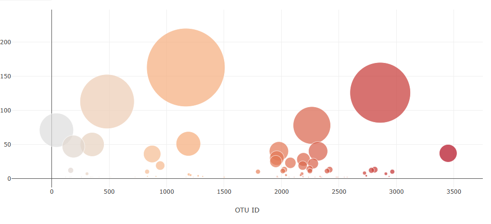

# belly-button-challenge

## Overview 

In this repository, the user utilized data from the Belly Button Biodiversity dataset, (http://robdunnlab.com/projects/belly-button-biodiversity/) that catologs microbes that colonize in the human belly button. JavaScript was the primary tool that was used to execute the code. Wtihin JS, D3 library and plotly were also utilized. Interactive dashboards were built such as a bar chart and bubble chart as well as a demographics table. 

## Analysis 

## Bar Chart
The interactive bar chart displays the top ten operational taxonomic units (OTUs), also known as microbial species that are found in a particular individual. The individual is identified using the interative demogrpahics table.

## Bubble Chart
The interactive bubble chart displays each sample that was collected for that specific individual. The x value represents the OTU IDs and the y value represents the sample values. 

## Results 

